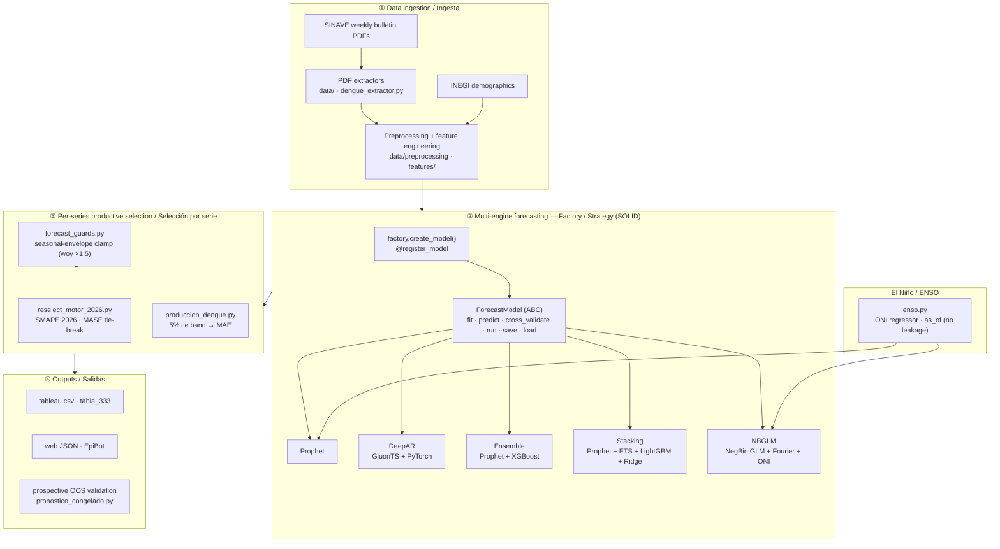

# EpiForecast-MX — Patent Code Bundle / Paquete de Código para Patente

> **Version:** generated by `scripts/build_patent_bundle.sh` · **Repo:** EpiForecast-MX
> **Scope:** the curated, self-contained subset that constitutes *the invention* — engine code, configuration, orchestration, and tests — with all documentary bloat, clinical data, and model binaries removed.
>
> **Guía completa con diagrama / Full guide with diagram:** `Guia-Patente.pdf` (LaTeX/TikZ, bilingüe).

---

## 1. What is in the bundle / Qué incluye

**EN —** Only the invention and the evidence it works. **ES —** Solo la invención y la evidencia de que funciona.

| Path | Contents | Why included |
|---|---|---|
| `src/epiforecast/` | Core package (~94 `.py`, ~15k LOC): `models/` (Factory + base + 5 engines), `data/`, `features/`, `evaluation/`, `visualization/`, `pipelines/`, `utils/` | The invention itself |
| `scripts/` | CLI entry points / orchestration (one-off recovery scripts excluded) | Reproducible operation |
| `config/` | OmegaConf YAML that parameterizes the method | The method is config-driven |
| `epi_modules/` | Interactive EPI console (peripheral) | Operator tooling |
| `tests/` | ~915 tests in 56 files | Evidence of correctness |
| `docs/model_cards/`, `docs/research/INFORME_ARQUITECTURA_MULTIMODELO.md` | Engine model cards + architecture report | Technical documentation |
| `pyproject.toml`, `requirements.txt`, `Makefile`, `README.md`, `.pre-commit-config.yaml`, `.python-version`, `epi.py`, `LICENSE` | Build, deps, quality contract, license | Buildable from clean clone |

## 2. What is deliberately excluded / Qué se excluye a propósito

`notebooks/` (~118 MB, base64-embedded outputs) · `references/` (~213 MB academic PDFs/photos) · `reports/` (~134 MB) · `data/` and `models/` (clinical IMSS data + `.pkl` binaries, private S3/DVC — **confidential, not claimable**) · `aws/` SageMaker infra (optional; contains a hardcoded AWS account id) · `.github/workflows/` CI/CD (the quality gate it runs is reproducible here via `make quality`) · `.dvc/` and `mlruns/` (data/model versioning + experiment tracking, parent-repo only) · `CLAUDE.md`, `GEMINI.md`, `.epi_history.json` (internal AI config / personal history) · `Congresos/`, `Stories/` (papers under double-blind review) · `checkpoints/`, `lightning_logs/` (regenerable artifacts).

> The repository is ~5.5 GB on disk; **the invention is ~2.5 MB.** Excluding the documentary bloat is what makes the deliverable reviewable.

---

## 3. Architecture / Arquitectura



<details><summary>ASCII fallback (no Mermaid renderer)</summary>

```
  SINAVE PDFs ─┐
               ├─► PDF extractors ─► Preprocessing + feature eng. ─┐
  INEGI demog ─┘                                                   │
                                                                   ▼
              ┌──────────── Factory / Strategy (SOLID) ────────────┐
              │ create_model() ─► ForecastModel (ABC: fit/predict/ │
              │                    cross_validate/run/save/load)    │
              │   ├─ Prophet   ├─ DeepAR   ├─ Ensemble              │
              │   ├─ Stacking  └─ NBGLM (NegBin + Fourier + ONI)    │
              └───────────────────────────┬────────────────────────┘
   ENSO/ONI regressor (enso.py) ──────────┤ (feeds NBGLM + Prophet)
                                          ▼
       Per-series selection: reselect_motor_2026.py (SMAPE+MASE),
       produccion_dengue.py (5% tie band → MAE),
       forecast_guards.py (seasonal-envelope clamp)
                                          ▼
       Outputs: tableau.csv / tabla_333 · web JSON / EpiBot ·
                prospective OOS validation (pronostico_congelado.py)
```
</details>

---

## 4. Patentable IP map / Mapa de IP patentable

Mapped to `file:function`, ordered by remaining defensibility (some strong candidates are **already partially disclosed** via the MICAI paper and the live site — see the audit report §5). / Mapeado a `archivo:función`, ordenado por defensibilidad restante.

| # | Contribution / Contribución | Location |
|---|---|---|
| 1 | **Seasonal-envelope clamp by epidemiological week** (caps each forecast week at that ISO-week historical max ×1.5, global-max fallback) — engine-agnostic plausibility guard; the *algorithm* is undisclosed | `models/forecast_guards.py` (`clamp_seasonal_envelope`) |
| 2 | **Deployable ENSO/ONI regressor** with damped-persistence future ONI and an `as_of` cutoff that prevents climate leakage in backtests | `data/enso.py` |
| 3 | **Multi-year NBGLM projection** (`freeze_trend`, `trend_anchor_weeks`, degenerate-series constant fallback) | `models/nbglm/model.py` |
| 4 | **Per-series engine selection / tie-break rules** (5% SMAPE tie band broken by MAE; "if it's zero, it's zero"; noisy→Ensemble fallback) — the *general idea* is disclosed; claim the concrete thresholds | `scripts/produccion_dengue.py`, `scripts/reselect_motor_2026.py` |
| 5 | **Frozen-forecast prospective OOS validation protocol** | `scripts/pronostico_congelado.py` |

**Not patentable (context only):** the Factory/registry pattern (`factory.py`) and `ForecastModel` interface (`base.py`) are GoF prior art; the SINAVE PDF extractor is novel in specifics but likely obvious.

---

## 5. Build & reproduce / Construir y reproducir

```bash
# Rebuild this curated bundle from the repository root:
bash scripts/build_patent_bundle.sh
# → dist/patent_bundle/  +  dist/epiforecast-patent-bundle.tar.gz  +  .sha256

# From inside the bundle (clean clone):
python -m venv .venv && . .venv/bin/activate
pip install -e ".[dev]"          # flit-built package `epiforecast`
make quality                     # ruff + mypy (strict) + pytest
python -m scripts.entrena        # train per config/base.yaml
python -m scripts.predice        # forecast
```

> **Reproducibility caveat / Salvedad:** the clinical IMSS data and `.pkl` model artifacts live in a **private** S3/DVC remote and are **not** in this bundle. To make the deliverable fully self-contained, attach a frozen data + model subset (or the source SINAVE PDFs + an end-to-end regeneration script) with documented checksums. See audit report §1 and §3.

## 6. Quality gate (measured at audit time) / Calidad medida

- **Ruff** `check .`: **0 errors**.
- **Mypy** (`strict = true`): **0 errors** across 94 source files (full return typing).
- **Pytest**: **~915 tests pass**, 0 failures.
- **Coverage**: **70%** (at the gate; core `prophet/model.py` at 55% — raise before freezing the snapshot).
- **SRP (≤300 lines/module):** 15 modules exceed it, concentrated in visualization/reporting (peripheral), not in the claimable logic; only `deepar/model.py` is the documented exception.

Full detail, severities, and the remediation checklist live in the parent repository's `reports/` (`AUDITORIA_PATENTE_CODIGO.md` and `AUDITORIA_INGENIERIA_CODIGO.md`); they are internal governance documents and are not shipped in this bundle.
